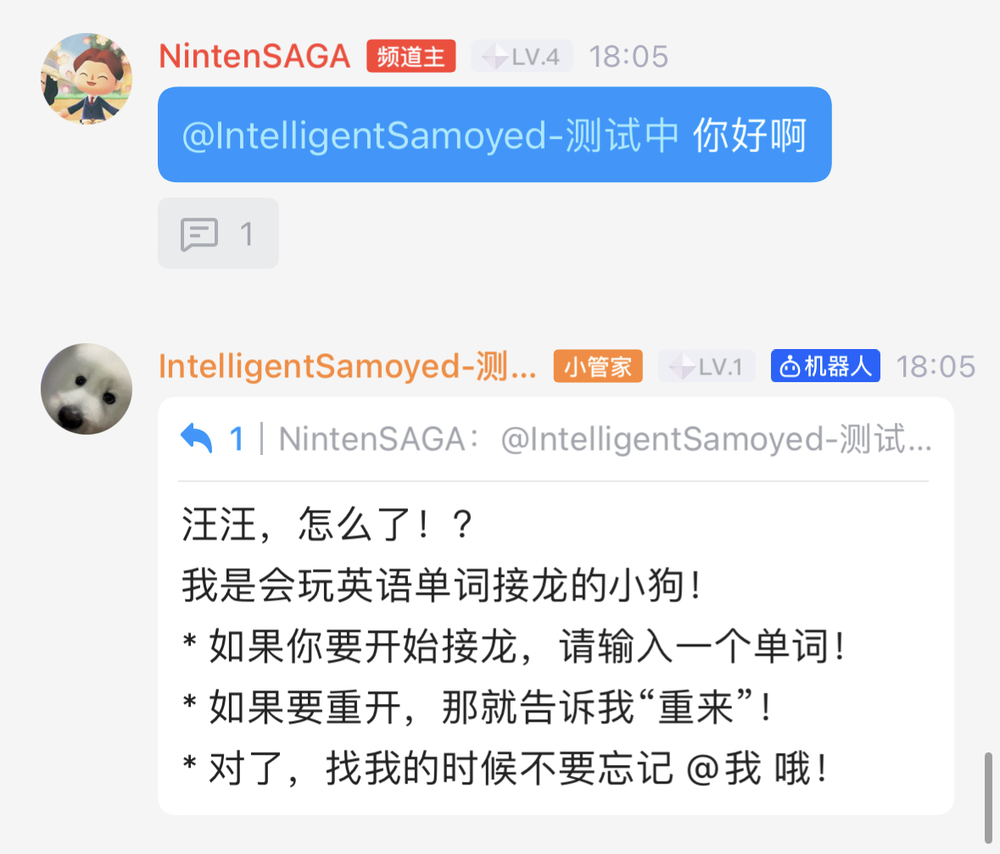
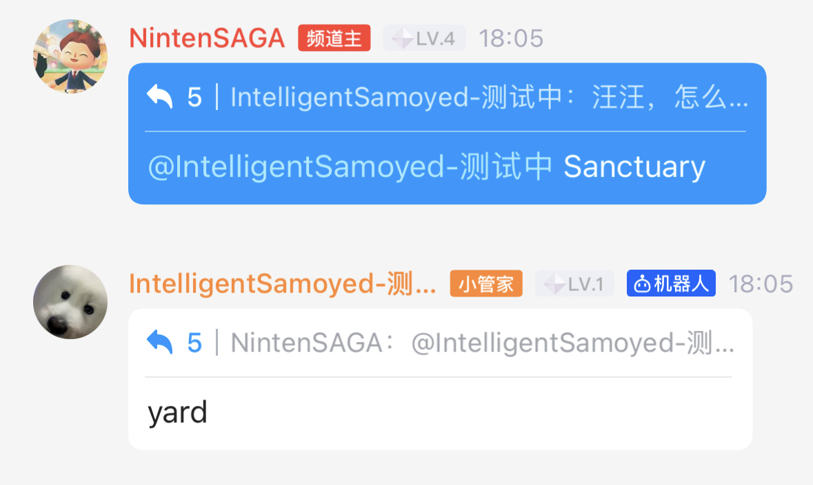
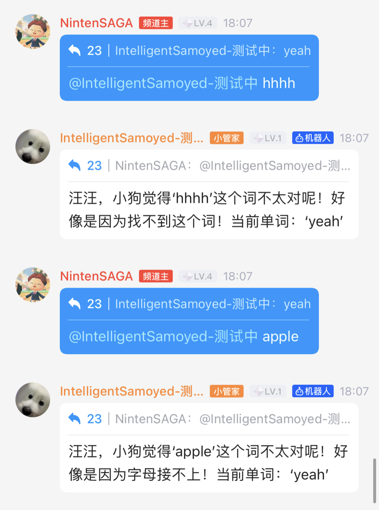
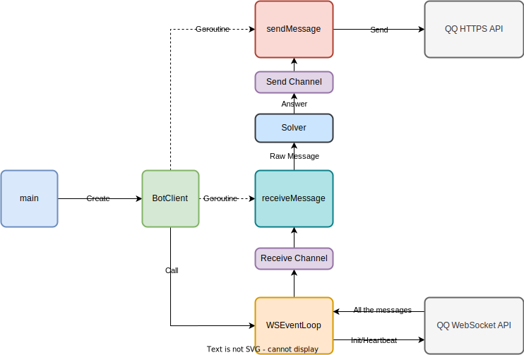

# SamoyedQQBot

> 一个会英语单词接龙的 QQ 机器人

https://github.com/NintenSAGA/SamoyedQQBot/assets/72867349/ef3660fb-0f57-4bad-96fb-77087438072b

## 部署

### 环境变量

* `BOT_TOKEN` 必须设置，对应[开发文档](https://bot.q.qq.com/wiki/develop/api/#bot-token)中的配置项
* `ONLINE` 选填，`true` 时使用正式环境 API，否则默认沙箱环境

### 运行

1. 直接运行：

```bash
> BOT_TOKEN="Your token" make run
```

2. 用 Docker 运行

```bash
> Docker built . -t qqbot
> docker run --env BOT_TOKEN="Your token" qqbot 
```

## 功能

1. 自我介绍



2. 单词接龙



3. 错误提示：错误单词 & 错误开头



4. 重新开始游戏


## 设计

### 依赖

采用 Golang 1.19 进行开发，通过 HTTPS & WebSocket 协议连接 QQ 开放 API，没有使用官方 SDK.

依赖的 packages：

* `github.com/gorilla/websocket` WebSocket 接入客户端
* `github.com/armon/go-radix` Radix Tree 数据结构，用于实现接龙

### 总体结构



**基本流程**

1. 创建 BotClient，并启动 sendMessage 和 receiveMessage 两个协程
2. 之后 BotClient 进入 WebSocket Event Loop 阶段
   1. 先与 QQ WebSocket API 建立连接
   2. 然后开始定期发送 heartbeat，并监听新消息
   3. 当收到消息时传入 Receive Channel
3. receiveMessage 收到 Receive Channel 中的消息后调用 Solver 进行处理，之后将 Solver 产生的结果传入 Send Channel
4. sendMessage 收到 Send Channel 中的消息后调用 HTTPS API 进行发送

### Solver 设计

Solver 通过 Trie（或者叫 Radix Tree）存储词库，基本流程如下：

1. 初始化时读取 `./data/wordlist.txt`，将其中的所有单词存储到 trie 中，并赋值 true，代表可用
2. 同时将当前单词标记为空
3. 当接收到用户输入的单词时进行判断：
   * Case 1:如果当前单词为空，则接受该单词（第一个单词由用户给出）
   * Case 2: 如果当前单词不为空，那么判断该输入词是否合理（该词存在 & 之前未出现 & 满足接龙要求）
4. 如果接受该单词：
   1. 在 trie 中标记该单词为 false
   2. 在 trie 中找到符合接龙要求的第一个词
5. 如果找到了单词，则返回给用户；否则认输，并将用户传入的词作为当前单词
6. 如果用户选择“重来”，则将 trie 中所有节点标记为 true

> 由于本地词库有限，检查单词存在是通过调用 [Free Dictionary API](https://dictionaryapi.dev/) 实现的，
>
> 同时用户传入的单词可被机器人记住，并留到下一盘使用。
